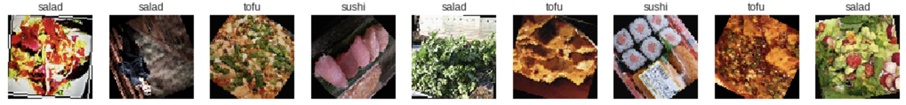
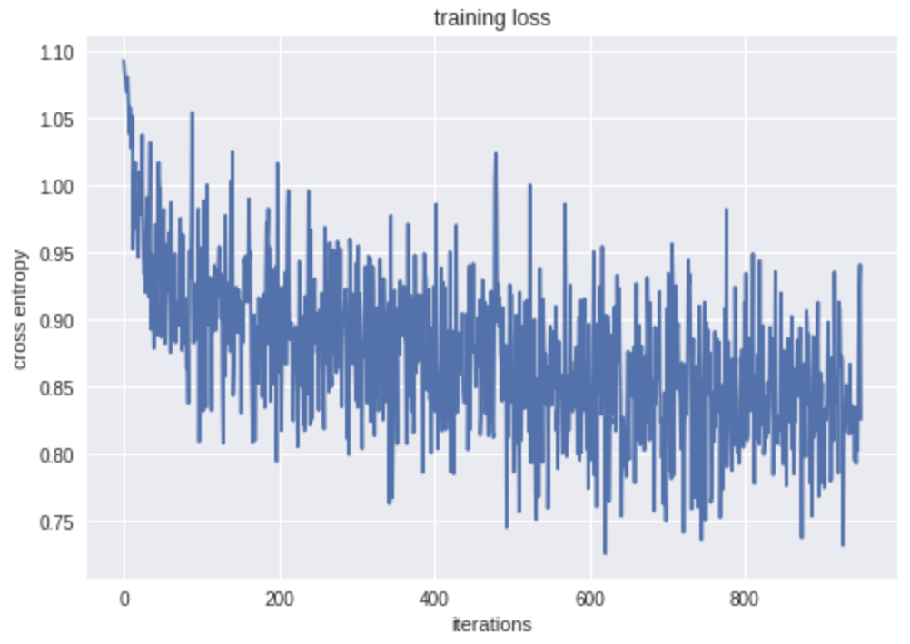
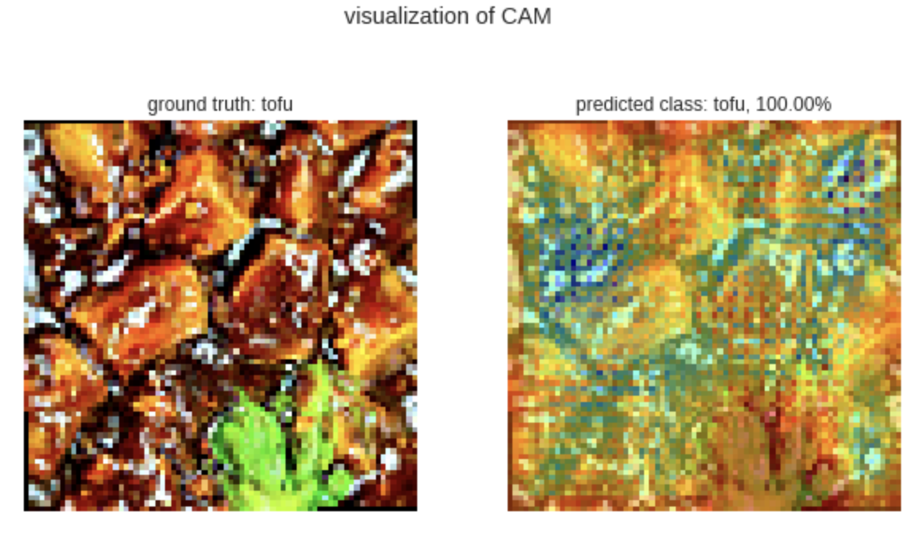

# Lecture Code for Co-enhance

This repository contains code for lectures given on AI. (Japanese)

## Prerequisites
Nothing! Just run this code in Google Colaboratory.
Users must obtain a [flickr API key](https://www.flickr.com/services/apps/create/) to scrape images.

## Sessions
- [Session 2](content/code/session2.ipynb)	: The basics for python
- [Session 3](content/code/session3.ipynb)	: Scraping images using the flickr API
- [Session 4-5](content/code/session4-5.ipynb)	: Creating a convolutional neural network and training
- [Session 6](content/code/session6.ipynb)	: Using the trained model for inference
- [Session 7-8](content/code/session7_8.ipynb)	: More basics of python programming

## TODO
- [ ] Convert into code for Jupyter Notebook
- [ ] Add lecture memos

## Images

